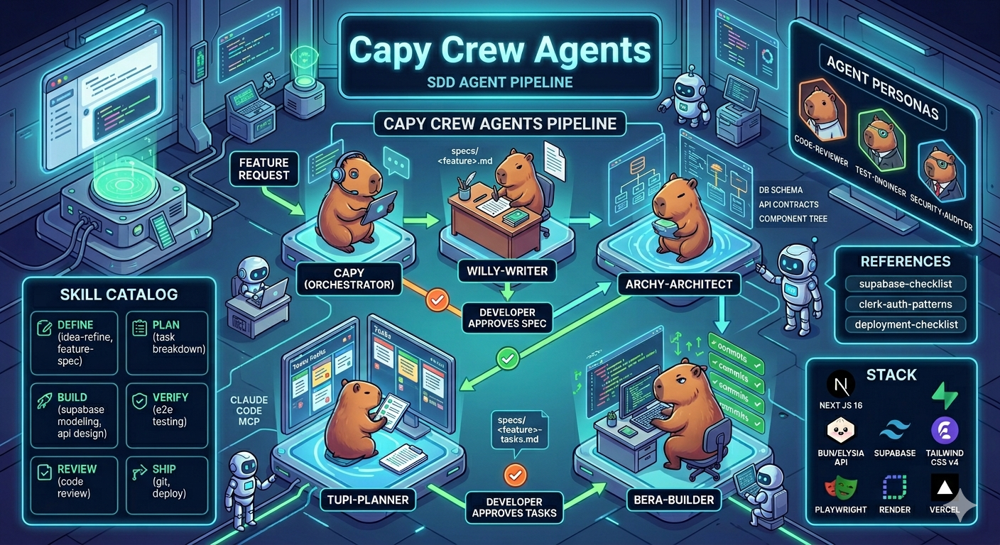

# Capy Crew Agents



A Claude Code plugin that enforces **Spec-Driven Development** through a crew of specialized subagents — and packages the skills, checklists, and personas that support the full development lifecycle.

---

## What is this?

Capy Crew Agents is a personal Claude Code plugin built around one core idea: **no code gets written before a spec is approved**.

It bundles two things:

**1. The capy-crew — a SDD agent pipeline**
Five subagents that take a feature from raw idea to committed code, with developer approval gates between each phase. The crew enforces the discipline of writing a spec and a task list before `bera-builder` touches a single file.

**2. A library of skills, references, and personas**
13 skills covering the full development lifecycle (Define → Plan → Build → Verify → Review → Ship), 6 reference checklists, and 3 review personas — all tuned to the Bun/Elysia + Next.js + Supabase + Clerk stack.

---

## The Capy-Crew Pipeline

```
┌─────────────────────────────────────────────────────────────────────┐
│                        Feature Request                              │
└──────────────────────────────┬──────────────────────────────────────┘
                               │
                               ▼
              ┌────────────────────────────────┐
              │             capy               │  ← orchestrator
              │  Coordinates the full pipeline │
              │  with approval gates           │
              └───────────────┬────────────────┘
                              │
               ┌──────────────▼──────────────┐
               │         willy-writter        │
               │  Reads codebase, writes spec │
               │  specs/<feature>.md          │
               └──────────────┬──────────────┘
                              │
                   ✋ Developer approves spec
                              │
               ┌──────────────▼──────────────┐
               │        archy-architect       │
               │  DB schema, API contracts,   │
               │  component tree              │
               └──────────────┬──────────────┘
                              │
               ┌──────────────▼──────────────┐
               │          tupi-planner        │
               │  Ordered atomic task list    │
               │  specs/<feature>-tasks.md    │
               └──────────────┬──────────────┘
                              │
                   ✋ Developer approves tasks
                              │
               ┌──────────────▼──────────────┐
               │          bera-builder        │
               │  Task 1 → commit             │
               │  Task 2 → commit             │
               │  Task N → commit             │
               └─────────────────────────────┘
```

| Agent | Role | Writes code? |
|-------|------|-------------|
| [capy](./agents/capy.md) | Pipeline orchestrator | No |
| [willy-writter](./agents/willy-writter.md) | Feature spec writer | No |
| [archy-architect](./agents/archy-architect.md) | Technical architect | No |
| [tupi-planner](./agents/tupi-planner.md) | Task list planner | No |
| [bera-builder](./agents/bera-builder.md) | Spec-faithful implementer | Yes |

---

## Install

**1. Add the marketplace (one-time per machine):**

```bash
claude plugin marketplace add dorian-morones/capy-crew-agents
```

**2. Install the plugin:**

```bash
claude plugin install capy-crew-agents
```

This makes all agents and the `/capy` slash command available in every project.

**Verify the install:**

```bash
claude plugin list
```

You should see `capy-crew-agents` in the list.

---

## Usage

**Start the full SDD pipeline:**

```
/capy add CSV import for feedback
```

Capy will run the crew in sequence — writing the spec, designing the architecture, breaking down tasks, and implementing them one commit at a time.

**Or invoke agents individually:**

```
"Use willy-writter to write a spec for [feature]"
"Use archy-architect on specs/[feature].md"
"Use tupi-planner on specs/[feature].md"
"Use bera-builder to implement Task 1 from specs/[feature]-tasks.md"
```

---

## Skill Catalog

Skills are loaded automatically when the plugin is installed. They guide Claude's behavior for each phase of development.

### Define
| Skill | When to use |
|-------|-------------|
| [idea-refine](./skills/idea-refine/SKILL.md) | Idea is vague or underspecified |
| [feature-spec](./skills/feature-spec/SKILL.md) | Starting any non-trivial feature |

### Plan
| Skill | When to use |
|-------|-------------|
| [planning-and-task-breakdown](./skills/planning-and-task-breakdown/SKILL.md) | Breaking a spec into executable tasks |

### Build
| Skill | When to use |
|-------|-------------|
| [supabase-data-modeling](./skills/supabase-data-modeling/SKILL.md) | Adding tables, RLS policies, migrations |
| [api-route-design](./skills/api-route-design/SKILL.md) | Creating or modifying Elysia routes |
| [nextjs-component-patterns](./skills/nextjs-component-patterns/SKILL.md) | Building Next.js pages or components |
| [incremental-implementation](./skills/incremental-implementation/SKILL.md) | Shipping in vertical slices |

### Verify
| Skill | When to use |
|-------|-------------|
| [e2e-with-playwright](./skills/e2e-with-playwright/SKILL.md) | Writing Playwright E2E tests |
| [debugging-and-error-recovery](./skills/debugging-and-error-recovery/SKILL.md) | Stuck on a bug for more than 15 minutes |

### Review
| Skill | When to use |
|-------|-------------|
| [code-review-and-quality](./skills/code-review-and-quality/SKILL.md) | Reviewing a PR or self-reviewing |
| [security-hardening](./skills/security-hardening/SKILL.md) | Touching auth, data access, or API exposure |

### Ship
| Skill | When to use |
|-------|-------------|
| [git-workflow-and-versioning](./skills/git-workflow-and-versioning/SKILL.md) | Committing or preparing a PR |
| [vercel-render-deploy](./skills/vercel-render-deploy/SKILL.md) | Deploying to Vercel or Render |

---

## References

Quick-reference checklists used alongside skills:

- [supabase-checklist.md](./references/supabase-checklist.md) — Migrations, RLS, query patterns
- [clerk-auth-patterns.md](./references/clerk-auth-patterns.md) — JWT, webhooks, middleware
- [deployment-checklist.md](./references/deployment-checklist.md) — Render + Vercel pre-deploy
- [testing-patterns.md](./references/testing-patterns.md) — Playwright, Bun test patterns
- [security-checklist.md](./references/security-checklist.md) — OWASP, CORS, input validation
- [performance-checklist.md](./references/performance-checklist.md) — Core Web Vitals, API latency

---

## Review Personas

Personas for focused review sessions — load as context, not subagents:

- [code-reviewer.md](./agents/code-reviewer.md) — correctness, security, maintainability
- [test-engineer.md](./agents/test-engineer.md) — behavior coverage, Playwright patterns
- [security-auditor.md](./agents/security-auditor.md) — auth, RLS, injection, secrets

---

## Roadmap

| Item | Status | Description |
|------|--------|-------------|
| **Hooks implementation** | Planned | Wire up `hooks/` lifecycle scripts — run shell commands on session start/end, before/after tool calls, or on specific triggers |
| **More skills** | Ongoing | Expand coverage: mobile (React Native/Swift), infrastructure (Terraform, Docker), data pipelines, LLM app patterns |
| **Persistent memory** | Planned | Let agents write and recall project-level facts across sessions — decisions made, patterns established, known constraints |
| **Skill versioning** | Planned | Tag and pin skill versions so projects can lock to a known-good set and opt into upgrades deliberately |
| **Community skill registry** | Idea | A shared index of installable skills from the community — `claude plugin install skill:api-route-design@dorian` |
| **Skill usage analytics** | Idea | Track which skills fire most often per project to surface gaps and refine trigger conditions |
| **Cross-project context** | Idea | A `global/` layer of references and personas that apply across all projects without per-project config |

---

## Contributing

### Adding a new skill

1. Create a directory under `skills/`: `skills/my-skill/`
2. Add `SKILL.md` following the format in [docs/skill-anatomy.md](./docs/skill-anatomy.md)
3. Required frontmatter:
   ```yaml
   ---
   name: my-skill
   description: Use when [specific trigger]. [One-sentence outcome].
   ---
   ```
4. Required sections: Overview → When to Use → Core Process → Specific Techniques → Common Rationalizations → Red Flags → Verification
5. Add an entry to the Skill Catalog in this README

### Adding a new agent

1. Add a `.md` file to `agents/`
2. Required frontmatter:
   ```yaml
   ---
   name: agent-name
   description: One sentence describing what it does and when to use it
   tools: Glob, Grep, Read, ...
   model: sonnet
   color: blue
   ---
   ```
3. If the agent is part of the capy-crew pipeline, update `agents/capy.md` to include it

### Adding a new reference

1. Add a `.md` file to `references/`
2. Use checklist format (`- [ ]`) for items that need to be verified
3. Add an entry to the References section in this README

### Standards

- Skill descriptions start with `"Use when"` — this is how Claude decides whether to load the skill
- Agent instructions are direct and imperative — no hedging
- Verification sections use checkboxes — every item must be binary (done or not done)
- No skill should exceed 1500 lines — move large examples to supporting files

See [CONTRIBUTING.md](./CONTRIBUTING.md) for the full guide and [docs/skill-anatomy.md](./docs/skill-anatomy.md) for the skill format reference.
