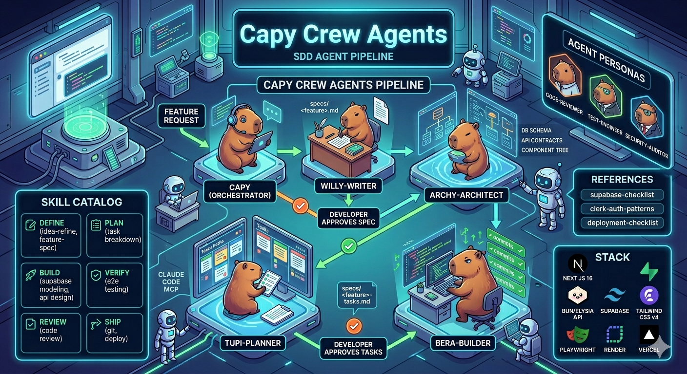

# Capy Crew Agents



Code written before requirements are clear is the leading cause of rewrites. **Capy Crew Agents** is a Claude Code plugin that enforces Spec-Driven Development: every feature begins with a written, approved spec before a single line of code is generated. The entire workflow — spec writing, architecture, task planning, implementation, review, and testing — is encoded as skills that load automatically when needed.

---

## What This Gives You

| Type | Count | How it works |
|------|-------|--------------|
| **Skills** | 17 | Load automatically when the conversation context matches their trigger — no invocation needed. Can also be called by name in natural language. |
| **Slash commands** | 7 | `/capy`, `/conventions`, `/spec`, `/plan`, `/build`, `/review`, `/ship` |
| **Reference checklists** | 6 | Static quick-lookup docs for Supabase, Clerk, deployment, testing, security, and performance |

Skills are not commands you run. Each skill has a `description` field that starts with "Use when...". When Claude detects the trigger condition in the conversation, the skill loads silently. You can also invoke any skill explicitly by naming it:

```
"use the writer skill to write a spec for CSV export"
"use capy to run the full pipeline for this feature"
"use the reviewer skill on this diff"
```

---

## Install

**1. Add the marketplace (one-time per machine):**

```bash
claude plugin marketplace add dorian-morones/capy-crew-agents
```

**2. Install the plugin:**

```bash
claude plugin install capy-crew-agents
```

After this, all 17 skills and 7 slash commands are active in every Claude Code session — no project-level `CLAUDE.md` changes required.

**3. Update when new versions ship:**

```bash
claude plugin marketplace update dorian-morones/capy-crew-agents
claude plugin update capy-crew-agents
```

---

## First: Teach It Your Stack

Skills in this plugin are stack-agnostic. What "correct" means in *your* client's codebase lives in that project's `.capy/conventions.md` — stack, layout, security invariants, naming, and the exact commands to typecheck and build.

Run this once per project:

```
/conventions
```

It reads the codebase, writes `.capy/conventions.md` from a template, and shows it to you for confirmation. Every rule cites a real file in your repo. After that, every coder and reviewer in the pipeline reviews against *your* project's rules instead of guessing from framework defaults.

Skip it and the pipeline infers patterns from neighbouring files — workable, but reviews get vaguer.

---

## How to Run a Feature

### Option A — Full pipeline, hands-off

```
"use capy to build the CSV export feature end to end"
```

The `capy` skill orchestrates the full pipeline: **conventions → spec → clarify → architecture → tasks → builder per task**. It runs writer → architect → planner in sequence, then spawns one builder per task.

The builder is itself an orchestrator. Inside it, a **coder** writes the task and a **reviewer** reviews the uncommitted diff, looping fix rounds until the review is clean:

```
capy
 ├─ writer      → specs/<feature>.md
 ├─ architect   → ## Architecture appended
 ├─ planner     → specs/<feature>-tasks.md
 └─ builder (one per task)
      ├─ coder     → writes the code
      ├─ reviewer  → reviews the uncommitted diff
      ├─ coder     → fix mode, applies findings
      └─ reviewer  → re-reviews  ⟳ max 2 fix rounds
           → returns clean → your commit gate
```

The coder is forbidden from committing, so the reviewer reads the working tree — review lands between writing and committing. A task reaches your commit gate only once the review is clean; if findings survive two fix rounds, the builder returns them to capy and capy asks you what to do.

You respond to prompts; capy handles coordination. Spec open questions and `[question]` findings are always yours to answer — no agent guesses on your behalf.

### Option B — One phase at a time

```
"use the writer skill to write a spec for adding CSV export"
```
Review `specs/csv-export.md`. Edit if needed. Then:

```
"use the architect skill on specs/csv-export.md"
```
Review the `## Architecture` section. Resolve any `[DECISION]` items. Then:

```
"use the planner skill on specs/csv-export.md"
```
Review `specs/csv-export-tasks.md`. Approve the task list. Then:

```
/build Task 1 from specs/csv-export-tasks.md
```
The builder writes it, reviews it, and fixes what the review finds. Review the diff yourself, commit, and repeat for each task.

To skip the review loop and just have the code written, use the coder skill instead:

```
"use the coder skill to implement Task 1 from specs/csv-export-tasks.md"
```

Neither one commits. You always review and commit each task before moving to the next.

---

## Skill Catalog

### Pipeline

| Skill | Trigger | What it does |
|-------|---------|--------------|
| [capy](./skills/capy/SKILL.md) | Orchestrating the full SDD pipeline end to end | Coordinates writer → architect → planner → builder-per-task, with developer approval gates between phases |
| [writer](./skills/writer/SKILL.md) | Writing a formal spec before any code is touched | Explores the codebase, writes `specs/<feature>.md` covering user story, acceptance criteria, API surface, data model, and open questions |
| [architect](./skills/architect/SKILL.md) | An approved spec needs a technical architecture | Appends `## Architecture` to the spec: DB schema with RLS, route contracts, TypeScript types, component decisions, and dependency order |
| [planner](./skills/planner/SKILL.md) | Architecture needs to become an ordered task list | Writes `specs/<feature>-tasks.md` — one task per layer, each ≤2h and independently committable |
| [builder](./skills/builder/SKILL.md) | Delivering one task written, reviewed, and fixed | Spawns a coder to write it and a reviewer to review the uncommitted diff, loops fix rounds until clean (max 2), returns to capy. Writes no code itself |
| [conventions](./skills/conventions/SKILL.md) | Setting up capy in a codebase for the first time | Reads the stack, layout, security invariants, and verification commands out of the code and writes `.capy/conventions.md` — the file every other skill reviews against |
| [coder](./skills/coder/SKILL.md) | Writing the code for one task, or applying review findings in fix mode | Reads spec + task list + every file it will touch first, matches existing patterns, implements exactly the task. Never commits |

### Review & Quality

| Skill | Trigger | What it does |
|-------|---------|--------------|
| [reviewer](./skills/reviewer/SKILL.md) | Reviewing a PR or self-reviewing before merging | Five-pass review (correctness → security → maintainability → tests → style) with `[blocker]`/`[concern]`/`[nit]` tagging |
| [security-auditor](./skills/security-auditor/SKILL.md) | Writing or auditing anything security-sensitive | Checks account scoping, input validation, auth middleware, supabaseAdmin usage, webhook verification, and secret handling |
| [test-engineer](./skills/test-engineer/SKILL.md) | Writing E2E, integration, or unit tests | Writes complete, independent tests using semantic selectors, asserting on visible behavior |

### Define

| Skill | Trigger | What it does |
|-------|---------|--------------|
| [idea-refine](./skills/idea-refine/SKILL.md) | Idea is vague or underspecified | Asks structured questions to turn a vague need into a specific technical direction |

### Plan

| Skill | Trigger | What it does |
|-------|---------|--------------|

### Build

| Skill | Trigger | What it does |
|-------|---------|--------------|
| [supabase-data-modeling](./skills/supabase-data-modeling/SKILL.md) | Adding tables, RLS policies, or writing migrations | Enforces migration naming, RLS policy templates, index conventions, and account-scoped queries |
| [api-route-design](./skills/api-route-design/SKILL.md) | Creating or modifying Elysia routes | Enforces body schema validation, auth middleware patterns, error types, and Swagger documentation |
| [nextjs-component-patterns](./skills/nextjs-component-patterns/SKILL.md) | Building Next.js pages or components | Guides server vs. client component decisions, data fetching patterns, and Tailwind conventions |

### Verify

| Skill | Trigger | What it does |
|-------|---------|--------------|
| [debugging-and-error-recovery](./skills/debugging-and-error-recovery/SKILL.md) | Stuck on a bug or unexpected behavior | Runs a hypothesis loop: form theory → find minimal reproduction → confirm or refute → fix root cause |

### Ship

| Skill | Trigger | What it does |
|-------|---------|--------------|
| [git-workflow-and-versioning](./skills/git-workflow-and-versioning/SKILL.md) | Committing, branching, or preparing a PR | Enforces conventional commits, atomic discipline, and trunk-based branching |
| [deploy-checklist](./skills/deploy-checklist/SKILL.md) | Deploying to production | Runs a pre-deploy checklist: env vars, build verification, auth key alignment, smoke tests |

---

## References

Static quick-reference checklists used alongside skills. References are for lookup; skills are for process.

- [supabase-checklist.md](./references/supabase-checklist.md) — Migrations, RLS, query patterns
- [clerk-auth-patterns.md](./references/clerk-auth-patterns.md) — JWT, webhooks, middleware
- [deployment-checklist.md](./references/deployment-checklist.md) — Render + Vercel pre-deploy
- [testing-patterns.md](./references/testing-patterns.md) — Playwright, Bun test patterns
- [security-checklist.md](./references/security-checklist.md) — OWASP, CORS, input validation
- [performance-checklist.md](./references/performance-checklist.md) — Core Web Vitals, API latency

---

## Contributing

See [CONTRIBUTING.md](./CONTRIBUTING.md) for the full guide.

Key rules:
- Skill descriptions must start with `"Use when"` — this is how Claude decides when to load them
- Agent instructions are imperative — no hedging, no "you might want to"
- No skill exceeds 1500 lines
